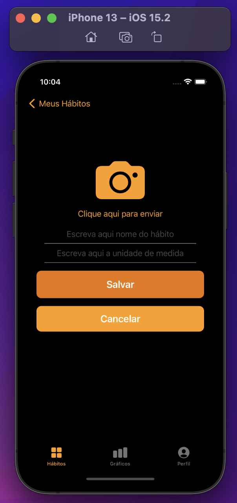
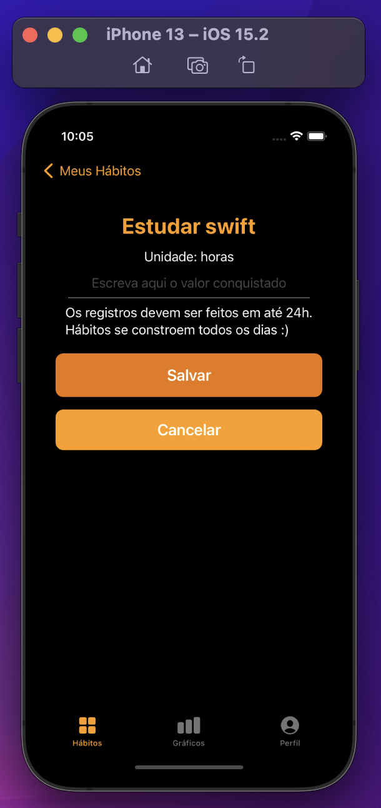
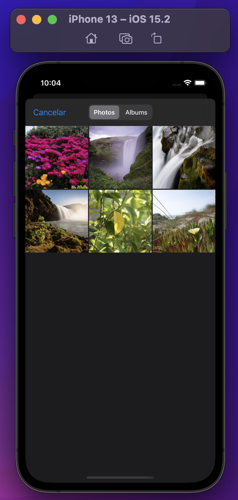
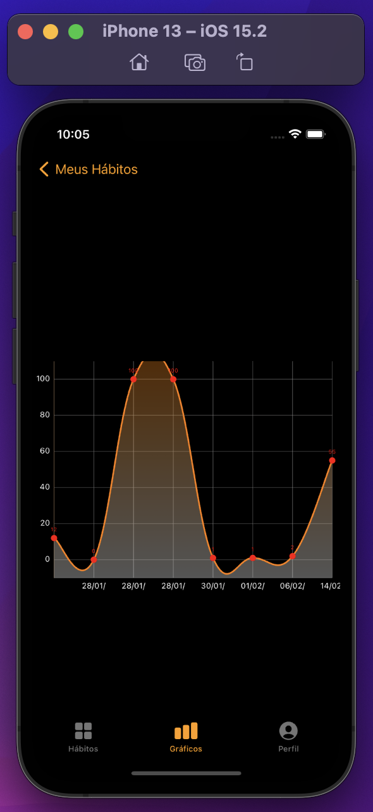
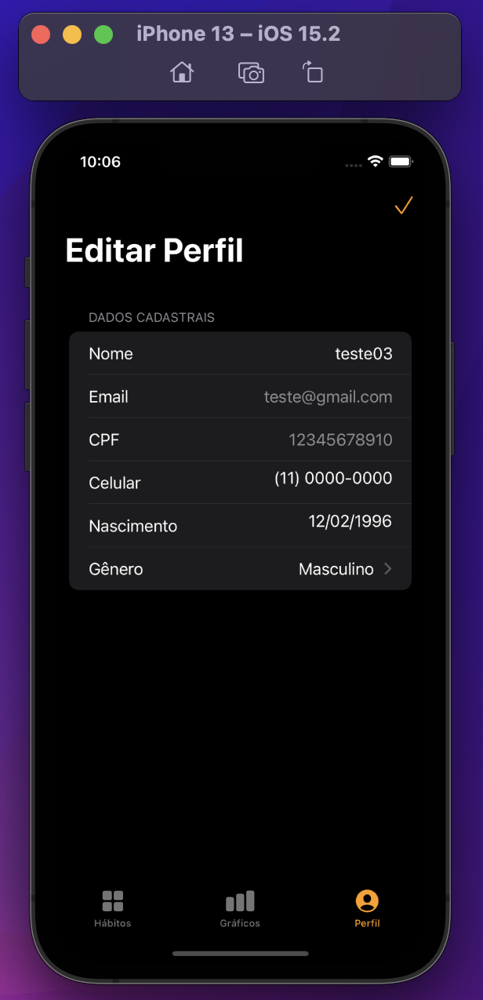

# Habit

  
     
      
      
      
      
  
      
      

✔️ Tecnologias

• SwiftUI: Um framework para aplicações iOS. 
• Xcode: Ambiente de desenvolvimento. 
• MVVM: Padrão de projeto Model - View - ViewModel. 
• Combine: Combine é framework reativo que fornece uma API Swift declarativa para processar valores ao longo do tempo. 
